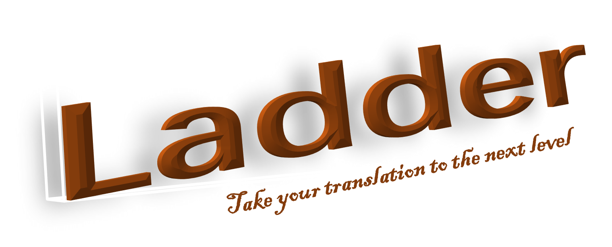
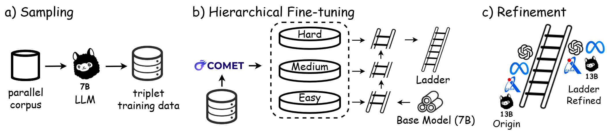

# Ladder: A Model-Agnostic Framework Boosting LLM-based Machine Translation to the Next Level



## **🔔 News**

- **[06/22/2024] We release the code and data of Ladder🪜**

## **🪜**About Ladder

**Ladder** is a novel, **model-agnostic** framework designed to enhance the performance of general-purpose Large Language Models (LLMs) in machine translation (MT). Unlike traditional methods that rely heavily on human-annotated data and extensive computational resources, Ladder provides a cost-effective solution that leverages existing LLMs without additional human costs.

### Obtaining Ladder involves a two-step process:



### Step 1: Sampling

1. **Generate Intermediate Translations**: Use an existing LLM to generate **intermediate translations** for each source sentence in a parallel corpus.
2. **Create Pseudo-Refinement Triplets**: Form triplets consisting of the source sentence, the intermediate translation, and the reference translation (the refined translation).

### Step 2: Hierarchical Fine-Tuning (HFT)

1. **Categorize Triplets**: Use COMET scores to categorize the pseudo-refinement triplets into three levels: Easy, Medium, and Hard.
2. **Fine-tune the Model**: Apply a hierarchical fine-tuning strategy, starting with Easy examples and progressively moving to Hard examples. 

### Using Ladder involves a straightforward process to refine translations produced by any target LLM:

1. **Generate Intermediate Translations**:
    - Use the target LLM to generate intermediate translations for the source sentence.
2. **Refine Translations with Ladder**:
    - Input the source sentence and the intermediate translation into Ladder.
    - Ladder will refine th intermediate translation to produce the final, high-quality translation.

## **🚀 Quick Links**

- [Download Ladder Models](#download)
- [Quick Usage](#use)
- [Environment Setup](#env)
- [Code Structure](#struct)
- [Ladder Pipeline](#pipeline)
- [Citation](#citation)

## **🤗Download Ladder Models**<a name="download"></a>

| Models | Base Model Link | LoRA Link |
| --- | --- | --- |
| Ladder-2B | https://huggingface.co/google/gemma-2b | https://huggingface.co/fzp0424/Ladder-2B-LoRA |
| Ladder-7B | https://huggingface.co/google/gemma-7b | https://huggingface.co/fzp0424/Ladder-7B-LoRA |

## **⚡Quick Usage**<a name="use"></a>

### ① Offline Refinement (manually fill the intermediate translation into test_case)

```python
import os
import torch
from peft import PeftModel
from transformers import AutoModelForCausalLM, AutoTokenizer
from utils.utils import LANG_TABLE
from utils.build_dataset import get_inter_prompt
from inference import get_pair_suffix, clean_outputstring
import logging
logger = logging.getLogger(__name__)

device = torch.device("cuda:1")

# Load base model and LoRA weights
base_model_path = "google/gemma-7b"
peft_path = "fzp0424/Ladder-7B-LoRA"

model = AutoModelForCausalLM.from_pretrained(base_model_path, torch_dtype='auto', device_map = device)
model = PeftModel.from_pretrained(model, peft_path, torch_dtype='auto', device_map = device)
model.merge_and_unload()
tokenizer = AutoTokenizer.from_pretrained(base_model_path, padding_side='left')

test_case = {
        "translation": {
            "pair": "en-zh", #source language - target language
            "en": "I think EMNLP is the best NLP conference in the world!", # "target language": "source sentence"
            "medium": "我认为EMNLP是最棒的会议", #"medium": "intermediate translation"
            "shots": []
        }
    }

item = test_case["translation"]
shots = item['shots'] 
src_lan = item['pair'].split("-")[0]
tgt_lan = item['pair'].split("-")[1]
prompt = get_inter_prompt(src_lan, tgt_lan, item, shots)
input_ids = tokenizer(prompt, return_tensors="pt", padding=True, max_length=512, truncation=True).input_ids.to(device)

# Translation
with torch.no_grad():
    generated_ids = model.generate(input_ids=input_ids, num_beams=5, max_new_tokens=256, do_sample=True, temperature=0.6, top_p=0.9)
output = tokenizer.batch_decode(generated_ids, skip_special_tokens=True)
suffix = get_pair_suffix(tgt_lan) 
suffix_count = output[0].count(suffix)
pred = clean_outputstring(output[0], suffix, logger, suffix_count)

print(pred)
```

### ① Online Refinement (get the intermediate translation from the target LLM automatically)

The whole code is in `demo.ipynb`

```python
...
# Paths to model directories
BASE_MODEL_PATH = "google/gemma-2b"
PEFT_MODEL_PATH = "fzp0424/Ladder-2B-LoRA"
TARGET_MODEL_PATH = "google/gemma-2b-it" #use gemma-2b-it as the target model

# Load target tokenizer and model
target_tokenizer = AutoTokenizer.from_pretrained(TARGET_MODEL_PATH, device_map=device)
target_model = AutoModelForCausalLM.from_pretrained(TARGET_MODEL_PATH, device_map=device)

# Test case for translation
test_case = {
    "translation": {
        "pair": "en-zh",
        "en": "The document, based on the Anti-Secession Law, the Criminal Law and the Criminal Procedure Law, provides more specific rules concerning conviction and sentencing in the event of such crimes, as well as relevant procedures, serving as guidance for the judiciary in handling relevant cases.",
        "shots": []
    }
}

# Extract source and target languages
src_lang = test_case["translation"]["pair"].split("-")[0]
tgt_lang = test_case["translation"]["pair"].split("-")[1]

# Generate medium translation using the target model
plain_prompt = get_plain_prompt(src_lang, tgt_lang, test_case["translation"])
medium_input_ids = target_tokenizer(plain_prompt, return_tensors="pt").to(device)
medium_outputs = target_model.generate(**medium_input_ids, num_beams=5, max_new_tokens=256, do_sample=True, temperature=0.6, top_p=0.9)
medium_output_text = target_tokenizer.decode(medium_outputs[0], skip_special_tokens=True)
plain_suffix = get_plain_suffix(tgt_lang)
plain_suffix_count = medium_output_text.count(plain_suffix)
medium_translation = clean_outputstring(medium_output_text, plain_suffix, logger, plain_suffix_count)
print("Raw Translation:\n", medium_translation)

# Update test case with medium translation
test_case["translation"]["medium"] = medium_translation
...
```

## **📃 Environment Setup**<a name="env"></a>

```bash
git clone https://github.com/fzp0424/Ladder.git
cd Ladder
conda create -n ladder python=3.10
conda activate ladder
pip install -r requirements.txt
```

## **📚** Code Structure<a name="struct"></a>

- `results/`: baselines and Ladder refined  outputs
- `dataset/`: our train set and test set
- `script/`: our scripts, including training, inference and evaluation

## 🖥️ Ladder Pipeline<a name="pipeline"></a>

### a) Fine-tune the base model using one file (Traditional Instruction Tuning)

Variables in `finetune.sh` : 

`pretrained_model`: base model; `train_file`: training file (.json); `output_dir`: the path where to save the checkpoint of the model; `data_cache_dir`: the path where to save the preprocessed datasets;  `prompt_strategy`: “intermediate” denotes using our instruction-following refinement task to fine-tune the model; “plain” denotes using the direct translation task.

```bash
cd script
sh finetune.sh
```

### b) Fine-tune the base model using HFT

`train_directory`: directory contains all hierarchy training files

```bash
sh HFT.sh
```

### c) Inference and evaluation

Note: In `inference_eval.sh`,  replace the {comet_path} and  {cometkiwi_path} by `Unbabel/wmt22-comet-da` and `Unbabel/wmt22-cometkiwi-da`; you can also download them to do the local evaluation.

```bash
comet-score -s "${src_path}" -t "${output_path}" -r "${tgt_path}" --batch_size 64 --model {comet_path} --gpus 1 > "${output_path}.comet"
comet-score -s "${src_path}" -t "${output_path}" --batch_size 64 --model {cometkiwi_path} --gpus 1 > "${output_path}.cometkiwi"
```

```bash
sh inference_eval.sh
```

## Citation

```latex

```